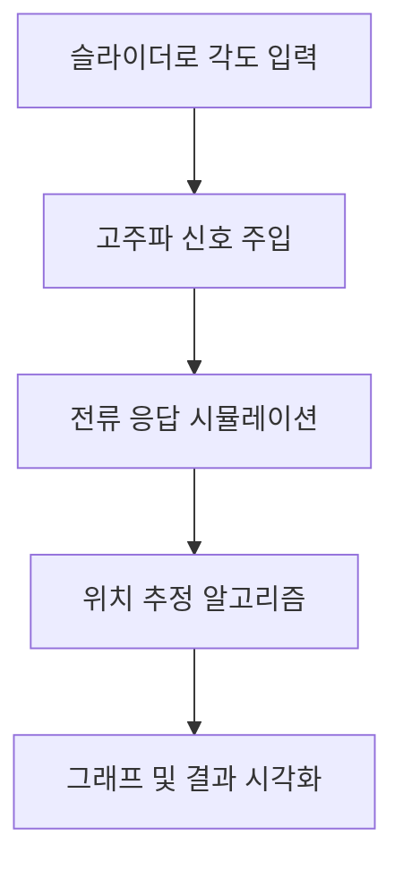
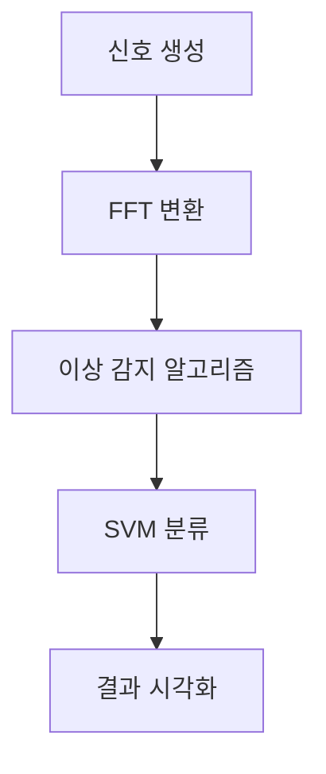

# 물리학Ⅱ 심화탐구: 전동기 센서리스 제어와 VVVF 구동음 이상 감지

## 프로젝트 개요


- **주제 1:** 전동기 센서리스 제어(고주파 주입 기반 위치 추출)
- **주제 2:** VVVF 구동음 FFT 이상 감지(머신러닝 포함)

---

## 1. 전동기 센서리스 제어(고주파 주입 기반 위치 추출)

### 목적
- 센서 없이 회전자의 위치를 추정하는 첨단 제어 원리를 이해하고, 직접 시뮬레이션하여 시각적으로 확인한다.

### 원리 요약
- **살리엔시(Saliency):** 회전자 위치에 따라 전동기 내부 임피던스가 달라지는 현상
- **고주파 주입:** 고주파 전압을 주입하면, 회전자 위치에 따라 전류 응답이 달라짐
- **위치 추정:** 전류 응답을 분석해 회전자 위치(각도)를 추정
- **180도 대칭 모호성:** 살리엔시 기반 위치 추정은 180도 대칭의 모호성이 존재하며, 실제 산업에서는 극성 판별 알고리즘을 추가로 사용

### 소프트웨어 구현
- Streamlit 기반 웹앱
- 사용자가 슬라이더로 회전자 초기 위치(각도)를 조절
- '고주파 주입 및 위치 추출' 버튼 클릭 시, 시뮬레이션 및 시각화
- d/q축, 회전자 위치, 전류 응답 등 시각적 표시
- 한글 UI, 한글 폰트 깨짐 방지

### 그래프/다이어그램 예시
- **matplotlib 예시:**
  - 회전자 각도별 전류 응답 그래프, d/q축 전류 변화, 위치 추정 결과 시각화
- **Mermaid 다이어그램:**


---

## 2. VVVF 구동음 FFT 이상 감지(머신러닝 포함)

### 목적
- 전동차 구동음 신호에서 이상(결함) 주파수를 FFT로 분석하고, 머신러닝(SVM)으로 자동 분류하는 과정을 체험합니다.

### 원리 요약
- **VVVF:** 전동차의 속도 제어를 위해 가변 주파수/전압을 공급하는 인버터
- **FFT:** 신호를 주파수 성분으로 분해하여 이상 주파수 검출
- **머신러닝(SVM):** FFT 스펙트럼을 특징 벡터로 사용, 정상/이상 신호를 자동 분류

### 소프트웨어 구현
- 정상/이상 신호(주파수, 진폭, 노이즈 등) 랜덤 생성
- FFT 스펙트럼 분석 및 이상음 자동 감지
- SVM 기반 자동 분류, 정확도/혼동행렬 출력
- 한글 UI, 실험 흐름 안내, 고등학생 눈높이 설명

### 그래프/다이어그램 예시
- **matplotlib 예시:**
  - 정상/이상 신호의 시간-주파수 그래프, FFT 스펙트럼, SVM 분류 결과 시각화
- **Mermaid 다이어그램:**


---

## 3. 탐구 과정의 어려움과 해결 방법

### 주요 어려움
- **180도 대칭 모호성:** 센서리스 위치 추정 시, 살리엔시 기반 방법은 180도 대칭의 모호성이 존재함
- **노이즈 및 신호 왜곡:** 실제 신호에 노이즈가 섞이면 FFT 이상 감지 및 위치 추정 정확도가 저하됨
- **임계값 설정:** 이상 감지 시 임계값을 어떻게 정할지, 데이터마다 달라서 어려움
- **데이터 다양성 부족:** 머신러닝 학습에 사용할 데이터가 부족하거나, 실제와 차이가 큼

### 해결 방법
- **180도 모호성:** 실제 산업에서는 극성 판별 알고리즘을 추가로 사용하며, 본 실험에서는 이론적 한계를 명확히 인지하고 결과 해석에 반영함
- **노이즈 대응:** 신호에 저역통과필터 등 간단한 필터링 적용, 여러 번 실험하여 평균값 사용
- **임계값:** 다양한 시나리오에서 실험하며 경험적으로 임계값을 조정, ROC 커브 등 활용 가능성 탐색
- **데이터 다양성:** 정상/이상 신호를 다양한 조건에서 랜덤 생성하여 데이터셋을 확장함

---

## 4. 향후 해결 과제 및 발전 방향
- **극성 판별 알고리즘 구현:** 180도 대칭 모호성 해결을 위한 극성 판별 로직 추가
- **실제 오디오/센서 데이터 분석:** 실제 전동차, 휠체어 등에서 수집한 신호로 실험 확장
- **스펙트로그램 등 고급 시각화:** 시간-주파수 변환(스펙트로그램) 등 다양한 시각화 기법 도입
- **머신러닝 기법 다양화:** SVM 외에 딥러닝, 앙상블 등 다양한 분류 알고리즘 적용
- **산업 현장 적용 검증:** 실제 산업 신호와 비교, 실용성 검증

---

## 6. 사회적 의미 및 확장성
- 장애인, 고령자 등 사회적 약자의 이동권과 안전을 위한 전동기 진단/제어 기술의 중요성 
- 실제 산업에서 사용되는 신호처리·AI 기술을 고등학생 수준에서 직접 구현·탐구
- 향후 실제 오디오 파일 분석, 스펙트로그램, 다양한 머신러닝 기법, 산업용 신호와의 비교 등으로 확장 가능

---

## 7. 파일 구성
- `spwm_plot.py` : 센서리스 제어(고주파 주입) 시뮬레이션 Streamlit 앱
- `vvvf_animation.py` : VVVF 구동음 FFT 이상 감지 및 머신러닝 Streamlit 앱
- `README.md` : 프로젝트 설명 및 실행 안내

---

## 8. 실행 환경 및 실행법
- Python 3.8 이상
- 필수 패키지: streamlit, numpy, matplotlib, scikit-learn
- 설치 및 실행 예시:
  ```bash
  pip install streamlit numpy matplotlib scikit-learn
  streamlit run spwm_plot.py
  streamlit run vvvf_animation.py
  ```

---

